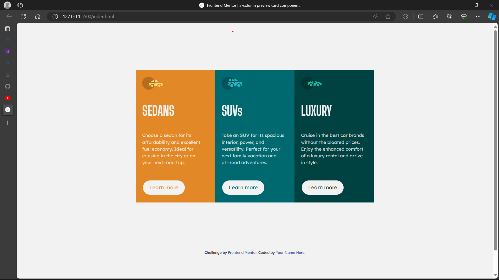

# Frontend Mentor - 3-column preview card component solution
This is a solution to the [3-column preview card component challenge on Frontend Mentor](https://www.frontendmentor.io/challenges/3column-preview-card-component-pH92eAR2-). Frontend Mentor challenges help you improve your coding skills by building realistic projects. 

## Table of contents

- [Overview](#overview)
  - [The challenge](#the-challenge)
  - [Screenshot](#screenshot)
  - [Links](#links)
  - [Built with](#built-with)
  - [What I learned](#what-i-learned)
- [Author](#author)

## Overview
This is a solution to the [3-column preview card component challenge on Frontend Mentor](https://www.frontendmentor.io/challenges/3column-preview-card-component-pH92eAR2-)

### The challenge

Users should be able to:

- View the optimal layout depending on their device's screen size
- See hover states for interactive elements

### Screenshots

)

### Links

- Solution URL: [Add solution URL here](https://your-solution-url.com)
- Live Site URL: [Add live site URL here](https://your-live-site-url.com)

### Built with

- Semantic HTML5 markup
- CSS custom properties
- Bootstrap CDN
- 
**Note: These are just examples. Delete this note and replace the list above with your own choices**

### What I learned
-learned how to style with bootsrap
-learned how to correctly arrange objects in CSS
-bettered my skills in CSS

### Continued development
-HTML
-CSS
-JS
-ReactJS
-Bootstrap
-TailwindCSS

## Author

- Frontend Mentor - [@yourusername](https://www.frontendmentor.io/profile/nanagyanfosu)

